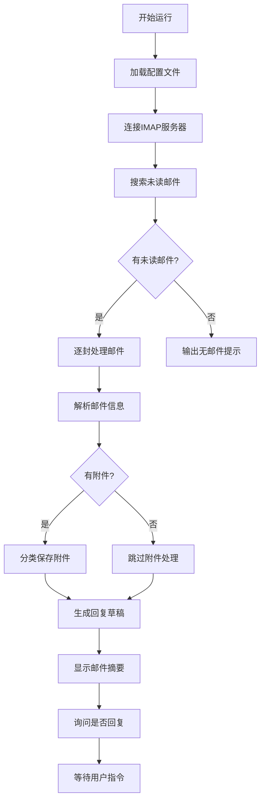

# 📧 邮箱自动化系统使用指南

## 🎯 系统概述
本系统是一个完整的邮件自动化处理工具，可以自动读取、处理、回复邮件，并智能保存附件。

## 📁 核心文件

### 1. **主程序文件**
- `read_email_with_config.py` - 主邮件处理脚本（最新版）
- `email_config.ini` - 配置文件（存储邮箱信息）

### 2. **辅助文件**
- `read_email.py` - 基础版脚本
- `test_qq_email.py` - QQ邮箱连接测试
- `test_connection.py` - 网络连接测试

## 🚀 快速开始

### 步骤1：获取QQ邮箱授权码
```
1. 登录QQ邮箱网页版 (mail.qq.com)
2. 点击"设置" → "账户"
3. 找到"POP3/IMAP/SMTP/Exchange/CardDAV/CalDAV服务"
4. 开启"IMAP/SMTP服务"
5. 按照提示发送短信验证
6. 获取16位授权码（保存好！）
```

### 步骤2：配置邮箱信息
编辑 `email_config.ini`：
```ini
email_account = 731073066@qq.com
email_password = 你的16位授权码
```

### 步骤3：运行脚本
```bash
python3 read_email_with_config.py
```

## ✨ 核心功能

### ✅ **邮件读取功能**
- 自动连接IMAP服务器
- 读取所有未读邮件
- 解析邮件头信息（发件人、主题、日期）
- 提取正文前200字符预览

### ✅ **附件处理功能**
- 智能分类保存附件：
  - 📄 **PDF文档** - `.pdf` 文件
  - 📊 **办公文档** - `.doc/.docx/.xls/.xlsx/.ppt/.pptx`
  - 🖼️ **图片资料** - `.jpg/.png/.gif/.bmp`
  - 📦 **压缩文件** - `.zip/.rar/.7z/.tar`
  - 📁 **其他文件** - 未分类文件

### ✅ **摘要生成功能**
- 人性化的邮件摘要展示
- JSON格式输出（便于程序处理）
- 统计信息汇总

### ✅ **回复草稿功能**
- 自动生成专业回复模板
- 保持邮件对话连贯性
- 可自定义回复模板

## 🔧 配置文件说明

### `email_config.ini` 详解：
```ini
[SERVER]
imap_host = imap.qq.com      # IMAP服务器地址
imap_port = 993              # 端口（通常993为SSL）
use_ssl = true              # 使用SSL加密

[ACCOUNT]
email_account = your_email@qq.com  # 邮箱账号
email_password = your_auth_code    # 密码或授权码

[SAVE]
attachment_dir = /tmp/Email_Attachments/  # 附件保存目录

[OPTIONS]
mark_as_read = false        # 处理邮件后是否标记为已读
preview_length = 200        # 正文预览长度
```

## 📊 支持的服务商

| 服务商 | IMAP服务器 | 端口 | SSL |
|--------|------------|------|-----|
| QQ邮箱 | imap.qq.com | 993 | 是 |
| 163邮箱 | imap.163.com | 993 | 是 |
| 网易邮箱 | imap.126.com | 993 | 是 |
| Gmail | imap.gmail.com | 993 | 是 |
| Outlook | outlook.office365.com | 993 | 是 |

## 💡 常见问题

### Q1: 登录失败怎么办？
**可能原因：**
1. 密码/授权码错误
2. 未开启IMAP服务
3. 账户被锁定

**解决方案：**
- 确认使用正确的授权码
- 检查QQ邮箱是否已开启IMAP服务
- 尝试网页登录解锁账户

### Q2: 连接超时怎么办？
**可能原因：**
1. 网络问题
2. 防火墙阻止
3. 服务器维护

**解决方案：**
- 检查网络连接
- 尝试关闭防火墙测试
- 等待服务器恢复

### Q3: 附件保存失败？
**可能原因：**
1. 目录权限不足
2. 磁盘空间不足
3. 文件名冲突

**解决方案：**
- 检查目录写入权限
- 清理磁盘空间
- 脚本会自动处理重复文件名

## 🔐 安全建议

1. **保护配置文件**：
   - 不要将 `email_config.ini` 上传到公共仓库
   - 定期更改邮箱授权码

2. **附件安全**：
   - 定期清理附件目录
   - 扫描附件中的恶意文件
   - 备份重要附件

3. **邮件安全**：
   - 警惕钓鱼邮件
   - 不要自动回复可疑邮件
   - 定期检查邮箱登录日志

## 📈 统计信息

系统运行后会显示：
```
📊 未读邮件摘要
未读邮件总数: 5
附件总数: 12
附件保存位置: /tmp/Email_Attachments/
处理时间: 15:23:47
```

## 🔄 工作流程



## 🎯 下一步扩展

### 计划功能：
1. **发送邮件功能** (`send_email.py`)
2. **邮件模板系统**
3. **附件批量处理**
4. **邮件归档功能**
5. **邮件统计分析**

### 开发计划：
1. 先测试基础邮件读取功能
2. 完善附件处理逻辑
3. 开发邮件发送功能
4. 集成邮件模板
5. 优化性能和安全

---

## 🆘 紧急问题处理

### 如果脚本无法运行：
1. 检查Python版本：`python3 --version`
2. 检查依赖库：`pip3 install email` (通常已内置)
3. 检查文件权限：`chmod +x read_email_with_config.py`

### 如果配置文件错误：
1. 备份现有配置：`cp email_config.ini email_config.ini.backup`
2. 重新创建配置：删除 `email_config.ini` 重新运行脚本
3. 手动编辑配置：参考上面的配置文件说明

---

## 📞 技术支持

如果有任何问题，可以：
1. 检查错误日志
2. 查看配置文件是否正确
3. 测试网络连接
4. 联系系统管理员

**祝您使用愉快！** 🎉