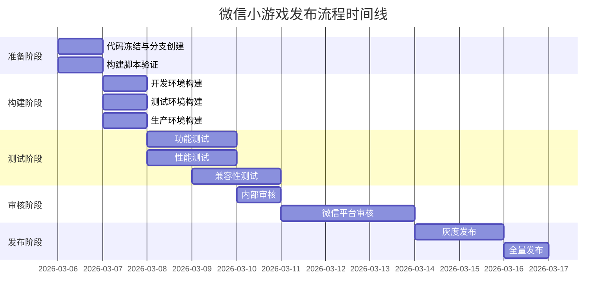

# 《微恐咖啡厅》微信小游戏发布流程文档

## 📋 文档概述
本文档详细描述从开发环境到微信小游戏正式上线的完整发布流程，包括构建、测试、审核、发布等各环节。

## 🎯 发布目标
- 确保游戏稳定、高效地发布到微信小游戏平台
- 建立标准化的发布流程，减少人为错误
- 提供可追溯的发布记录和版本管理

## 📅 发布时间线


## 📁 发布前准备

### 1. 代码准备
#### 1.1 代码冻结
- [ ] 确定发布版本号
- [ ] 创建发布分支 `release/v1.0.0`
- [ ] 合并所有待发布的代码修改
- [ ] 更新 `CHANGELOG.md`

#### 1.2 版本控制
```bash
# 创建发布分支
git checkout -b release/v1.0.0

# 更新版本号
# package.json
{
  "version": "1.0.0"
}

# project.json
{
  "version": "1.0.0"
}

# game.json (微信小游戏)
{
  "version": "1.0.0",
  "versionCode": 100
}
```

### 2. 配置准备
#### 2.1 环境配置
- [ ] 开发环境配置（测试用）
- [ ] 测试环境配置（内部测试）
- [ ] 生产环境配置（线上发布）

#### 2.2 微信小游戏配置
- [ ] `game.json` 配置检查
- [ ] `project.config.json` 配置检查
- [ ] 广告位ID配置
- [ ] 支付商户号配置

### 3. 资源准备
#### 3.1 美术资源
- [ ] 检查所有图片资源格式（PNG, JPG）
- [ ] 检查图片尺寸和压缩率
- [ ] 检查音频资源格式（MP3, OGG, WAV）
- [ ] 检查资源引用完整性

#### 3.2 配置资源
- [ ] 游戏配置表
- [ ] 本地化文件
- [ ] 运营活动配置

## 🛠️ 构建流程

### 1. 构建前检查
```bash
# 检查代码规范
npm run lint

# 检查TypeScript编译
npx tsc --noEmit

# 运行单元测试（如果有）
npm test
```

### 2. Cocos Creator构建
#### 2.1 开发环境构建
```bash
# 使用Cocos Creator CLI构建
cocos build --platform wechatgame --debug

# 或使用npm脚本
npm run build:debug
```

#### 2.2 测试环境构建
```bash
# 测试环境构建
cocos build --platform wechatgame --test

# 或使用自定义配置
npm run build:test
```

#### 2.3 生产环境构建
```bash
# 生产环境构建（发布用）
cocos build --platform wechatgame --release

# 或使用npm脚本
npm run build:release
```

### 3. 构建配置参数
```json
{
  "platform": "wechatgame",
  "debug": false,
  "sourceMaps": false,
  "compressTexture": true,
  "textureFormat": "jpg",
  "quality": 80,
  "autoAtlas": true,
  "mergeStartScene": true,
  "inlineSpriteFrames": true,
  "md5Cache": true
}
```

### 4. 构建产物检查
#### 4.1 文件完整性
- [ ] 主包文件存在
- [ ] 分包文件存在
- [ ] 配置文件存在
- [ ] 资源文件存在

#### 4.2 包体大小检查
```bash
# 检查主包大小
du -h build/wechatgame/game.js

# 检查资源包大小
du -h build/wechatgame/assets/**

# 检查总包大小
du -h build/wechatgame/
```

#### 4.3 版本信息检查
- [ ] 版本号正确
- [ ] 构建时间正确
- [ ] 环境标识正确

## 🧪 测试流程

### 1. 功能测试
#### 1.1 核心功能测试
- [ ] 游戏启动测试
- [ ] 咖啡制作测试
- [ ] 顾客服务测试
- [ ] 经济系统测试

#### 1.2 UI测试
- [ ] 界面布局测试
- [ ] 交互响应测试
- [ ] 适配性测试
- [ ] 本地化测试

### 2. 性能测试
#### 2.1 帧率测试
```javascript
// 性能监控示例
const performanceMonitor = {
  fps: 0,
  memory: 0,
  drawCalls: 0
};
```

#### 2.2 内存测试
- [ ] 内存泄漏测试
- [ ] 资源释放测试
- [ ] 加载性能测试

### 3. 兼容性测试
#### 3.1 设备兼容性
| 设备类型 | 测试重点 | 结果 |
|---------|---------|------|
| iPhone | iOS版本兼容 | |
| Android | 各厂商系统 | |
| 平板 | 大屏适配 | |

#### 3.2 微信版本兼容
| 微信版本 | 基础库版本 | 测试结果 |
|---------|-----------|---------|
| 7.0+ | 基础库2.0+ | |
| 8.0+ | 基础库2.8+ | |
| 最新版 | 最新基础库 | |

### 4. 回归测试
- [ ] 历史bug验证
- [ ] 核心功能回归
- [ ] 性能回归测试

## 📱 微信平台发布

### 1. 微信开发者工具上传
#### 1.1 项目配置
1. 打开微信开发者工具
2. 导入项目目录
3. 配置AppID
4. 配置项目信息

#### 1.2 代码上传
```bash
# 使用CLI上传（可选）
微信开发者工具-cli upload \
  --project /path/to/build \
  --version 1.0.0 \
  --desc "版本描述"
```

### 2. 提交审核
#### 2.1 审核材料准备
- [ ] 游戏介绍文案
- [ ] 测试账号
- [ ] 版本说明
- [ ] 合规声明

#### 2.2 审核注意事项
1. **内容合规**
   - 无违规内容
   - 无敏感词汇
   - 年龄分级正确

2. **技术合规**
   - API使用规范
   - 广告展示规范
   - 数据收集合规

### 3. 审核后处理
#### 3.1 审核通过
1. 确认审核意见
2. 处理审核反馈（如有）
3. 准备发布

#### 3.2 审核驳回
1. 分析驳回原因
2. 修改相应问题
3. 重新提交审核

## 🚀 上线发布

### 1. 灰度发布策略
#### 1.1 按比例灰度
```yaml
灰度阶段:
  - 阶段1: 1% 用户
  - 阶段2: 10% 用户  
  - 阶段3: 50% 用户
  - 阶段4: 100% 用户
```

#### 1.2 按用户群体灰度
- 内部员工 → 核心用户 → 全量用户

### 2. 发布监控
#### 2.1 监控指标
```javascript
const monitorMetrics = {
  // 业务指标
  dau: '日活跃用户',
  retention: '留存率',
  revenue: '收入',
  
  // 技术指标
  crashRate: '崩溃率',
  errorRate: '错误率',
  performance: '性能指标'
};
```

#### 2.2 告警配置
- 崩溃率 > 1% 告警
- 错误率 > 5% 告警
- 收入波动 > 20% 告警

### 3. 发布后验证
#### 3.1 功能验证
- [ ] 线上功能验证
- [ ] 支付流程验证
- [ ] 广告展示验证

#### 3.2 性能验证
- [ ] 线上性能监控
- [ ] 用户反馈收集
- [ ] 问题排查处理

## 📊 版本管理

### 1. 版本号规则
```
版本号格式: X.Y.Z
X - 主版本号 (重大更新)
Y - 次版本号 (功能更新)  
Z - 修订版本号 (Bug修复)
```

### 2. 版本发布记录
| 版本号 | 发布日期 | 发布类型 | 主要内容 | 负责人 |
|-------|---------|---------|---------|--------|
| 1.0.0 | 2026-03-16 | 新功能 | 游戏上线 | ReleaseManager |
| 1.0.1 | - | 热修复 | Bug修复 | - |
| 1.1.0 | - | 功能更新 | 新内容 | - |

### 3. 版本回滚预案
#### 3.1 回滚条件
- 严重bug影响超过30%用户
- 收入大幅下降超过50%
- 重大安全事故

#### 3.2 回滚步骤
1. 确认回滚版本
2. 备份当前版本数据
3. 执行版本回滚
4. 发布回滚公告

## 🔧 运维支持

### 1. 监控系统
#### 1.1 技术监控
- 服务器监控
- 应用性能监控
- 错误日志监控

#### 1.2 业务监控
- 用户行为分析
- 收入监控
- 广告收益监控

### 2. 告警处理
#### 2.1 告警等级
- P0: 紧急（立即处理）
- P1: 重要（2小时内处理）
- P2: 一般（24小时内处理）

#### 2.2 值班安排
| 时间段 | 值班人 | 联系方式 |
|-------|-------|---------|
| 工作日9-18 | 张三 | 138xxxxxx |
| 其他时间 | 李四 | 139xxxxxx |

## 📋 发布检查清单
- [ ] 代码冻结完成
- [ ] 构建通过
- [ ] 测试通过
- [ ] 审核通过
- [ ] 监控就绪
- [ ] 回滚预案就绪
- [ ] 文档更新
- [ ] 团队通知

---

## 📝 附录

### A. 微信小游戏配置示例
```json
// game.json
{
  "deviceOrientation": "portrait",
  "networkTimeout": {
    "request": 5000,
    "connectSocket": 5000,
    "uploadFile": 60000,
    "downloadFile": 60000
  },
  "openDataContext": "src/openDataContext",
  "subpackages": [
    {
      "name": "assets",
      "root": "assets/"
    }
  ]
}
```

### B. 紧急联系方式
- 技术负责人: ReleaseManager
- 产品负责人: _________
- 运营负责人: _________
- 客服负责人: _________

### C. 常用命令
```bash
# 构建命令
npm run build:debug     # 开发环境构建
npm run build:test      # 测试环境构建
npm run build:release   # 生产环境构建

# 检查命令
npm run lint           # 代码检查
npm run prettier       # 代码格式化
```

---

**文档版本**: 1.0  
**最后更新**: 2026-03-05  
**更新人**: ReleaseManager  
**下次评审**: 2026-03-12