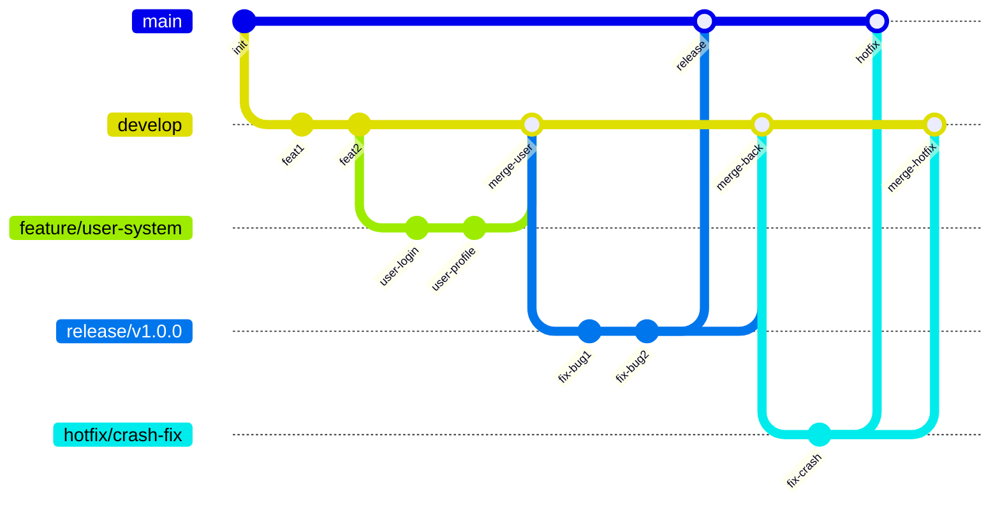
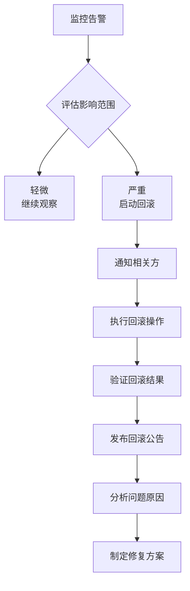
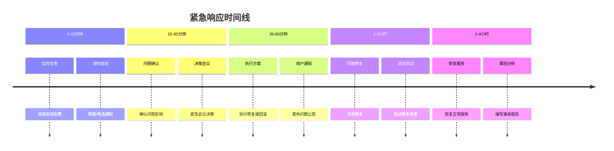

# 《微恐咖啡厅》微信小游戏版本管理文档

## 📋 文档概述
本文档定义《微恐咖啡厅》微信小游戏的版本管理规范，包括版本号规则、分支管理策略、发布流程和回滚机制。

## 🎯 版本管理目标
1. 确保代码版本的一致性
2. 实现高效的多版本并行开发
3. 建立标准化的发布流程
4. 提供可靠的版本回滚能力
5. 保证历史版本的追溯性

## 📊 版本号规范

### 1. 版本号格式
```
版本号格式: X.Y.Z[-标识]
X - 主版本号 (Major)
Y - 次版本号 (Minor)
Z - 修订版本号 (Patch)
[-标识] - 预发布标识 (可选)
```

### 2. 版本号递增规则
| 版本类型 | 递增规则 | 描述 | 示例 |
|---------|---------|------|------|
| **主版本** | X++ | 重大更新，不向下兼容 | 1.0.0 → 2.0.0 |
| **次版本** | Y++ | 功能更新，向下兼容 | 1.0.0 → 1.1.0 |
| **修订版本** | Z++ | Bug修复，向下兼容 | 1.0.0 → 1.0.1 |
| **预发布** | 加后缀 | 测试版本 | 1.0.0-beta1 |

### 3. 版本标识说明
| 标识 | 说明 | 使用场景 |
|------|------|---------|
| `alpha` | 内部测试版本 | 内部功能测试 |
| `beta` | 公开测试版本 | 小范围用户测试 |
| `rc` | 发布候选版本 | 发布前最终测试 |
| `snapshot` | 开发快照版本 | 开发中的临时版本 |

### 4. 版本文件更新
需要同步更新版本号的文件：
1. `package.json`
```json
{
  "version": "1.0.0"
}
```

2. `project.json`
```json
{
  "version": "1.0.0"
}
```

3. `game.json` (微信小游戏)
```json
{
  "version": "1.0.0",
  "versionCode": 100
}
```

**注意**: `versionCode` = X * 100 + Y * 10 + Z

## 🌿 Git分支管理策略

### 1. 分支类型定义
| 分支类型 | 命名规则 | 生命周期 | 保护规则 |
|---------|---------|---------|---------|
| **主分支** | `main` | 永久 | 禁止直接push |
| **开发分支** | `develop` | 永久 | 需Code Review |
| **功能分支** | `feature/*` | 短期 | 开发者自行管理 |
| **发布分支** | `release/*` | 短期 | 发布团队管理 |
| **热修复分支** | `hotfix/*` | 短期 | 紧急修复专用 |

### 2. 分支工作流


### 3. 分支操作规范

#### 3.1 功能分支开发
```bash
# 创建功能分支
git checkout develop
git pull origin develop
git checkout -b feature/user-system

# 开发完成后
git add .
git commit -m "feat: 用户系统登录功能"
git push origin feature/user-system

# 创建Pull Request到develop分支
```

#### 3.2 发布分支创建
```bash
# 从develop创建发布分支
git checkout develop
git pull origin develop
git checkout -b release/v1.0.0

# 更新版本号
npm version 1.0.0

# 推送到远程
git push origin release/v1.0.0
```

#### 3.3 热修复分支创建
```bash
# 从main创建热修复分支
git checkout main
git pull origin main
git checkout -b hotfix/critical-bug

# 修复bug
git add .
git commit -m "fix: 修复严重崩溃问题"

# 合并到main和develop
git checkout main
git merge hotfix/critical-bug
git checkout develop
git merge hotfix/critical-bug
```

## 📦 发布流程管理

### 1. 发布周期
| 发布类型 | 预计周期 | 审批流程 | 发布时间 |
|---------|---------|---------|---------|
| **紧急热修复** | 1-2天 | 技术负责人审批 | 随时 |
| **常规修复** | 1周 | 产品+技术审批 | 每周四 |
| **功能更新** | 2-4周 | 产品+技术+运营审批 | 每月第2周 |
| **大版本** | 3-6个月 | 管理层审批 | 季度末 |

### 2. 发布检查清单
#### 2.1 代码检查
- [ ] 所有测试用例通过
- [ ] 代码Review完成
- [ ] 无合并冲突
- [ ] 版本号已更新

#### 2.2 构建检查
- [ ] 构建脚本执行成功
- [ ] 包体大小符合要求
- [ ] 资源压缩正常
- [ ] 配置文件正确

#### 2.3 测试检查
- [ ] 功能测试通过
- [ ] 性能测试达标
- [ ] 兼容性测试通过
- [ ] 安全性测试通过

#### 2.4 文档检查
- [ ] 更新日志已编写
- [ ] 用户文档已更新
- [ ] 发布说明已准备
- [ ] 运维文档已更新

### 3. 发布审批流程
```
开发者 → 技术负责人 → 产品负责人 → 运营负责人 → 发布
    ↓        ↓            ↓            ↓
代码质量  技术评审     产品验收     运营准备
```

## 🔄 版本回滚机制

### 1. 回滚触发条件
| 条件 | 严重程度 | 响应时间 | 负责人 |
|------|---------|---------|-------|
| 崩溃率 > 5% | P0 | 1小时内 | 技术负责人 |
| 收入下降 > 50% | P1 | 2小时内 | 产品负责人 |
| 用户投诉率 > 10% | P2 | 4小时内 | 运营负责人 |
| 重大安全漏洞 | P0 | 立即 | 安全负责人 |

### 2. 回滚决策流程


### 3. 回滚操作步骤
```bash
# 1. 确定回滚版本
git log --oneline --graph main
# 找到稳定的历史版本

# 2. 创建回滚分支
git checkout main
git checkout -b rollback/v1.0.0-to-v0.9.5

# 3. 执行回滚
git revert <commit-hash> --no-edit

# 4. 验证回滚
npm run build
npm test

# 5. 合并回滚
git checkout main
git merge rollback/v1.0.0-to-v0.9.5

# 6. 重新发布
git tag v1.0.0-rollback
git push origin main --tags
```

### 4. 回滚预案文档
每次发布前必须准备的回滚预案：
1. **数据备份方案**
2. **代码回滚步骤**
3. **配置回滚步骤**
4. **用户通知模板**
5. **问题分析模板**

## 📝 变更日志规范

### 1. CHANGELOG格式
```
# 变更日志

## [版本号] - 发布日期
### 新增
- 描述新增功能

### 修复
- 描述修复的问题

### 优化
- 描述性能优化

### 移除
- 描述移除的功能

### 已知问题
- 描述已知但未修复的问题
```

### 2. 提交信息规范
| 类型 | 前缀 | 描述 | 示例 |
|------|------|------|------|
| 功能 | `feat:` | 新功能 | `feat: 添加咖啡制作系统` |
| 修复 | `fix:` | Bug修复 | `fix: 修复顾客AI逻辑错误` |
| 文档 | `docs:` | 文档更新 | `docs: 更新API文档` |
| 样式 | `style:` | 代码样式 | `style: 调整代码格式` |
| 重构 | `refactor:` | 代码重构 | `refactor: 重构经济系统` |
| 性能 | `perf:` | 性能优化 | `perf: 优化资源加载速度` |
| 测试 | `test:` | 测试相关 | `test: 添加单元测试` |
| 构建 | `build:` | 构建相关 | `build: 更新构建脚本` |

### 3. 自动化工具
```bash
# 安装commitlint
npm install @commitlint/cli @commitlint/config-conventional --save-dev

# 配置commitlint.config.js
module.exports = {
  extends: ['@commitlint/config-conventional']
};

# 安装standard-version
npm install standard-version --save-dev

# 自动生成CHANGELOG
npx standard-version
```

## 📁 版本归档策略

### 1. 归档周期
| 版本类型 | 归档周期 | 保留策略 |
|---------|---------|---------|
| 预发布版本 | 1个月 | 自动删除 |
| 正式版本 | 永久 | 永久保留 |
| 热修复版本 | 6个月 | 可删除 |
| 失败版本 | 1周 | 分析后删除 |

### 2. 归档内容
1. **源代码**: 完整的Git标签
2. **构建产物**: `.wxapkg`文件
3. **配置信息**: 各环境配置文件
4. **测试报告**: 完整的测试文档
5. **发布记录**: 发布决策文档

### 3. 归档目录结构
```
归档/版本库/
├── v1.0.0/
│   ├── 源代码/
│   ├── 构建产物/
│   ├── 配置文件/
│   ├── 测试报告/
│   └── 发布记录/
├── v1.0.1/
│   └── ...
└── 版本索引.md
```

## 🚨 紧急响应流程

### 1. 紧急联系人
| 角色 | 姓名 | 电话 | 邮箱 | 职责 |
|------|------|------|------|------|
| 技术负责人 | 张三 | 138****0001 | tech@example.com | 技术决策 |
| 产品负责人 | 李四 | 138****0002 | product@example.com | 产品决策 |
| 运营负责人 | 王五 | 138****0003 | ops@example.com | 用户沟通 |
| 发布经理 | ReleaseManager | 138****0004 | release@example.com | 发布执行 |

### 2. 紧急响应流程


### 3. 紧急预案模板
```markdown
# 紧急预案: [问题描述]

## 1. 问题描述
- 发生时间: 
- 影响范围: 
- 严重程度: 

## 2. 紧急联系人
- 技术: [姓名] [电话]
- 产品: [姓名] [电话]
- 运营: [姓名] [电话]

## 3. 应急步骤
1. [第一步]
2. [第二步]
3. [第三步]

## 4. 沟通模板
- 内部沟通: 
- 用户公告: 
- 媒体声明: 

## 5. 事后检查
- [ ] 问题原因分析
- [ ] 防止措施制定
- [ ] 流程优化建议
```

## 📊 版本统计报表

### 1. 版本发布统计
| 指标 | 本月 | 本季度 | 本年累计 |
|------|------|-------|---------|
| 发布次数 | 2 | 6 | 24 |
| 功能更新 | 15 | 45 | 180 |
| Bug修复 | 32 | 96 | 384 |
| 回滚次数 | 0 | 1 | 3 |

### 2. 质量指标
| 指标 | 目标值 | 实际值 | 趋势 |
|------|-------|-------|------|
| 崩溃率 | < 1% | 0.5% | ↓ |
| 用户满意度 | > 90% | 92% | ↑ |
| 发布成功率 | > 95% | 98% | ↑ |
| 回滚率 | < 5% | 2% | ↓ |

### 3. 团队效率
| 指标 | 目标值 | 实际值 | 说明 |
|------|-------|-------|------|
| 发布周期 | 2周 | 1.5周 | 平均发布时间 |
| 修复响应 | 4小时 | 3小时 | 紧急问题响应 |
| 代码Review | 100% | 98% | Code Review覆盖率 |

## 📋 附录

### A. 常用命令
```bash
# 查看版本历史
git tag -l
git log --oneline --graph --all

# 创建标签
git tag v1.0.0
git push origin v1.0.0

# 删除标签
git tag -d v1.0.0-beta1
git push origin :refs/tags/v1.0.0-beta1

# 版本对比
git diff v1.0.0 v1.1.0
```

### B. 配置文件示例
```json
// .github/workflows/release.yml
name: Release Workflow
on:
  push:
    tags:
      - 'v*'
jobs:
  build-and-release:
    runs-on: ubuntu-latest
    steps:
      - uses: actions/checkout@v3
      - name: Setup Node.js
        uses: actions/setup-node@v3
      - name: Install dependencies
        run: npm ci
      - name: Build
        run: npm run build:release
      - name: Upload artifacts
        uses: actions/upload-artifact@v3
        with:
          name: release-build
          path: build/
```

### C. 模板文件
1. **发布公告模板**: `templates/release-announcement.md`
2. **回滚通知模板**: `templates/rollback-notification.md`
3. **版本计划模板**: `templates/version-plan.md`
4. **问题报告模板**: `templates/issue-report.md`

### D. 工具推荐
1. **版本管理**: Git + GitHub/GitLab
2. **自动化发布**: GitHub Actions / Jenkins
3. **版本生成**: standard-version / semantic-release
4. **文档生成**: JSDoc / TypeDoc
5. **监控告警**: Sentry / Datadog

---

**文档版本**: 1.0  
**最后更新**: 2026-03-05  
**更新人**: ReleaseManager  
**生效日期**: 2026-03-06  
**评审周期**: 每季度评审更新